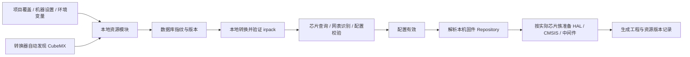

# STM32 本地资源：所有权、准备与执行

2026-09-16。取代“构建机器准备 engines/data/stm32，安装版直接读取”的旧路径。

## 产品边界

- Yoma 发布程序：`stm32kernel`、`stm32ck-import` 和网表引擎。
- CubeMX 数据库、生成的 irpack、HAL/CMSIS 和中间件属于用户本机资源，不上传，不放入安装包。
- 用户通过 CubeMX 下载固件。Yoma 只读取已有目录，不启动 CubeMX GUI，不下载替代固件。
- 安装包暂存使用可分发数据白名单，源目录即使存在旧 STM32 数据也不会被复制。转换器缺失是安装错误，数据库缺失是本机资源未配置，二者分别处理。

## 一条执行链

入口是 `packages/kernel/src/host/domain/stm32/resources.ts`。
`netlist` 和 `stm32config` 都调用它，桌面端和 bench 共用同一份内核实现。
领域层不读取 Electron 状态，不反向引用会话管理器。

会话使用同一个只读 `--probe` 检查来决定是否向模型提供 `stm32config`。
没有本地 CubeMX 或配置失效时不激活该工具，也不为了使用它自动安装 CubeMX。
通用 `netlist` 仍可读取原始连线，但不会引导模型添加需要器件数据库的 `part` 参数。
每次用户发起新一轮时重新检查，因此安装 CubeMX 或修正设置后，已有会话也可恢复能力；检查本身不生成数据缓存。

### 来源优先级

1. 项目 `.yoma/toolchain.local.json` 中同名工具记录。
2. `<configDir>/toolchains.json` 中用户设置的记录。
3. `STM32CK_CUBEMX_DB` / `STM32CUBE_REPOSITORY`。
4. 数据库由原生转换器自动定位；固件先读 CubeMX 的 `~/.stm32cubemx/plugins/updater/updater.ini` 的 `RepositoryPath`，再找默认 `~/STM32Cube/Repository`。

两个记录 ID 是 `stm32cubemx` 和 `stm32cube-repository`。显式路径失效时报告错误，不静默换到另一套版本。
数据库定位只有转换器一份实现，支持安装根、db 目录、Mac `.app` 的 Resources/MacOs/MacOS 布局；TypeScript 不再维护第二份安装路径列表。

### 能力按操作判断

| 操作 | 所需资源 |
| --- | --- |
| `schema`、原始网表连线 | 引擎程序 |
| 芯片查询、带芯片的网表识别、配置校验 | CubeMX 数据库转换出的有效器件包 |
| 完整工程生成 | 有效配置 + 对应族的本地 HAL/CMSIS，按配置使用已有中间件 |
| 工程编译 | 生成工程 + 本机编译器、CMake、Ninja |

`generate` 先校验配置，再准备固件。错误配置保留引擎的结构化诊断，不被“缺固件”遮住。
芯片族取自 `describe-mcu`，不靠型号前缀猜。固件选择已下载目录中数值版本最高的一份；最新包不完整时提示修复，不偷偷退回旧版本。
设置页保存目录只记录来源；通用工具链“已就绪”的状态含义仍有独立审查项，见审查报告。

## 缓存与生命周期

缓存位于 `<configDir>/stm32/cache/`，默认是用户 `~/.yoma`，测试与隔离宿主可以注入目录。

- 数据库缓存身份包含源文件内容指纹、数据库版本、转换器和读取引擎的哈希、归一化格式版本。
- 固件缓存身份另包含族、包版本及选中组件的内容指纹。HAL、设备 CMSIS 和 Core CMSIS 都来自同一个本地包，避免隐式混搭。
- 先写私有暂存目录，转换后由消费引擎实际读取校验；再验证源数据未在准备期间变化，最后原子发布到独立 generation 路径。
- 重用时校验快照文件及内容，损坏快照忽略并重建。已有目录不改名、不覆盖，正在运行的调用继续使用它持有的路径。
- 同进程相同准备任务合并；一个等待者取消不影响其他等待者，全部取消才停止准备。不同进程可生成相同内容的独立副本，不互相破坏路径。
- 更新后旧版本留存；本轮没有自动垃圾回收，避免清掉其他宿主持有的资源。旧缓存清理属于后续独立生命周期工作。

生成成功后，工程目录写入 `stm32-resources.json`：数据库版本/指纹、引擎指纹、固件包版本/指纹。它不包含用户绝对路径，可用于追溯和比较；当前不提供按此文件自动安装或固定旧版本的功能。

## 验收边界

自动回归覆盖：来源优先级、无固件查询、缓存复用、损坏恢复、数据/引擎变化失效、准备期间源变化、不完整固件拒绝、取消与并发、配置诊断优先、版本记录、安装资源排除私有数据，以及 Windows/Mac 路径布局。

本机真实验收使用隔离配置目录，从已安装 CubeMX 准备全部 27 个族，对真实网表执行 `board_ir`，以 G4 V1.6.3 的本地固件生成 G473RCTx / PA5 LED 工程，并用 Arm GCC、CMake、Ninja 编译链接。所有数据与生成产物留在忽略目录 `out/stm32-runtime-validation/`，没有进入源码或发行物。

Mac 路径布局由自动测试覆盖，但本轮在 Windows 上执行，不能替代 Mac 安装机实际验收。
后续同类结构问题见 [架构审查：本地资源与运行状态](架构审查-本地资源与运行状态.md)。
